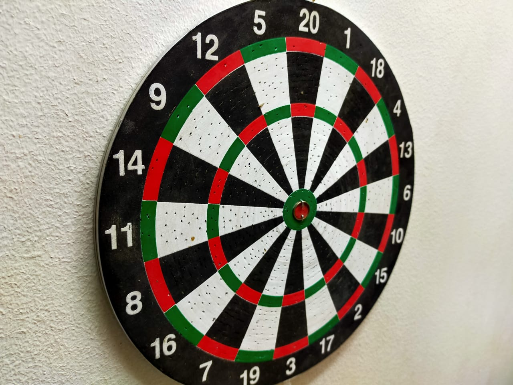
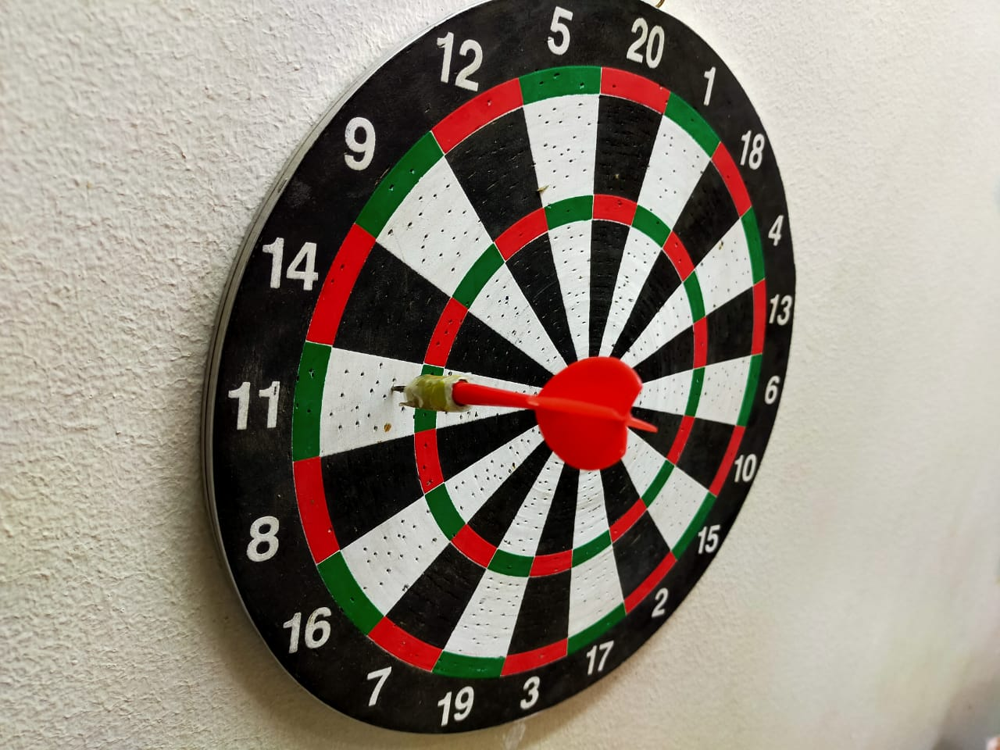

# DartsMobileApp
Android application based on Digital Image processing to detect darts scoring 

## Implementation
this project is implemented in python for the algorithm and flutter for the application GUI

## Background 
description of the project algorithm :
# first the user will input the first image without any dart on the board (background image)

 
Then this image is proccessed to obtain the regions of the board respectively like : 
|multipliers |double       |
|------------|-------------|
|  | |
then the user inputs the board image that contains the dart want to detect it's score 

## Installation
will be updated 

