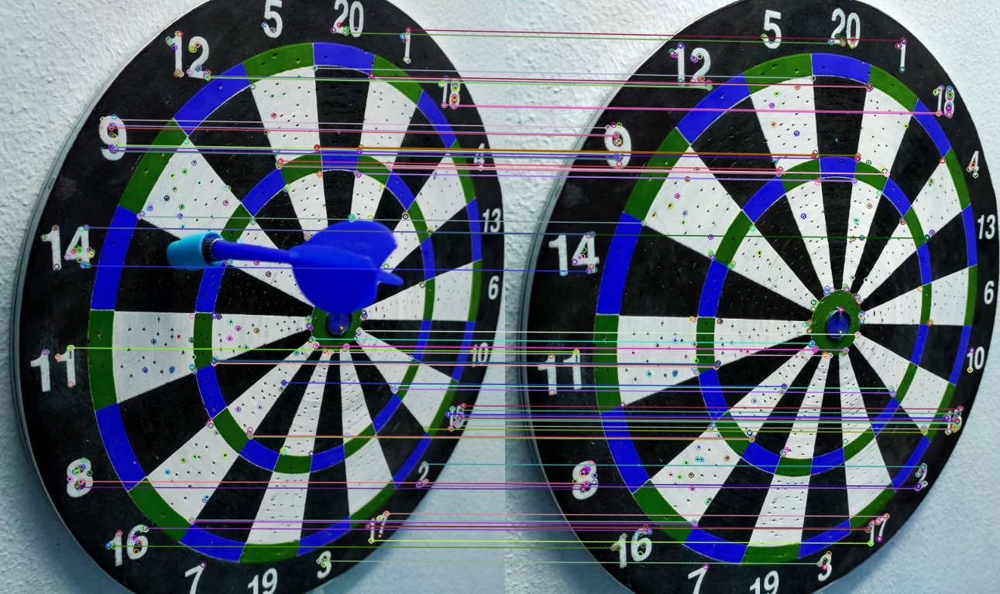

# DartsMobileApp
Android application based on Digital Image processing to detect darts scoring 
##Team Members : 
Amir rami zaref
Andrew atef fathy
Andrew morcos nagib

## Implementation
this project is implemented in python for the algorithm and flutter for the application GUI

## Background 
### Description of the Project Algorithm :
### First: the user will input the first image without any dart on the board like this image (background image)
 

### This image is proccessed to get the regions of interest:
first we get the red and green regions of the image then by adding these regions we get the multipliers then by making some 
morpholigical and diffrenences changes on these images we obtain the following regions acts as a mask for our work 
|Red         |Green        |
|------------|-------------|
|||
 
|multipliers |triple       |
|------------|-------------|
|||
 
|double      |single       |
|------------|-------------|
|||
 
|outerBull   |innerBull    |
|------------|-------------|
|||
 

### Then the user inputs the board image that contains the dart want to detect it's score 
 

### Align the two images 
aligning the background and the dart image to make the dart image very close to the background image
 

### Detect 20 Sectors of the board 
Detect the 20 Straight lines and their angles of interest 
 

### then get the difference between the two images to detect the the dart position and apply closing method 
 
|diff image  |after closing|
|------------|-------------|
|||

### Then using the region props we detect the Apex of the arrow and it's coordinates and orientation 

### Finally This is the output : 
 

## Installation
will be updated 

